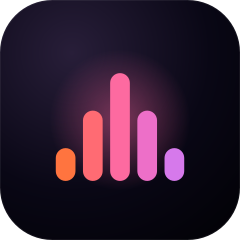
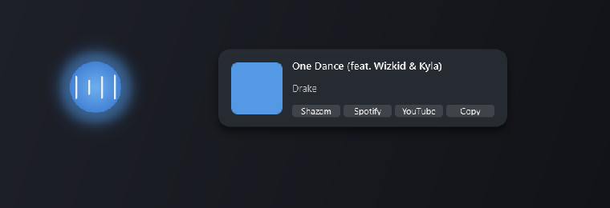
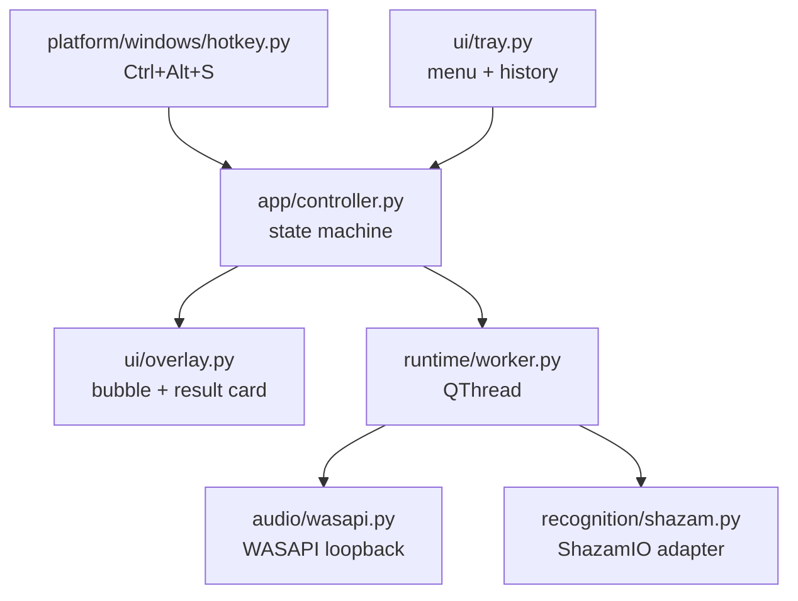

<p align="center">
  
</p>

<h1 align="center">SongKey</h1>

<p align="center"><strong>Press a key. Name the song.</strong></p>

<p align="center">
  A tiny Windows tray utility. <code>Ctrl+Alt+S</code> listens to whatever's playing through your
  speakers, names it, and gets out of your way — no microphone, no API key, no subscription,
  no account.
</p>

<p align="center">
  
  
  
</p>

<p align="center">
  
</p>

## What it does

1. Press `Ctrl+Alt+S` (or use the tray menu) — a glowing bubble appears within ~100ms.
2. SongKey captures six seconds of whatever your system is currently outputting, via WASAPI
   loopback — not your microphone.
3. The clip is fingerprinted and matched (via [ShazamIO](https://github.com/shazamio/ShazamIO)).
4. A result card appears: cover art, title, artist, and one-click actions — open on Shazam,
   search Spotify or YouTube, or copy `Artist — Title` to your clipboard.
5. Misclicked or want to bail? Click the bubble to cancel; click it again to restart listening.
6. Everything auto-dismisses in a few seconds. The last five matches stay one right-click away,
   in the tray menu.

No audio ever touches disk. No recognition history is sent anywhere but Shazam's own (unofficial)
API. Nothing runs until you press the key.

## Why

Existing "name that song" tools on Windows either want a subscription, a cloud account, or a
paid API key. SongKey doesn't ask for any of that: point it at your own default output device,
get an answer, move on.

## Architecture

SongKey is a small layered app, built specifically so the parts that need real Windows hardware
(audio capture, global hotkeys) stay swappable and testable behind protocols — most of the app
has no idea PyAudioWPatch or a physical keyboard exist.



- **`app/controller.py`** owns the state machine (`IDLE → CAPTURING → RECOGNIZING → FOUND/NOT_FOUND/NO_AUDIO/ERROR → IDLE`)
  and operation-ID bookkeeping. It imports nothing from Qt, PyAudioWPatch, or ShazamIO — every
  dependency is an injected callable, so the whole state machine is unit-tested with fakes, no
  Windows hardware or Qt event loop required.
- **`runtime/worker.py`** is a `QObject` moved to its own `QThread`; it does the actual capture +
  recognition off the GUI thread and reports back through Qt signals.
- **`audio/`** and **`recognition/`** are Protocol-typed boundaries — `WasapiCapture` and
  `ShazamRecognitionProvider` are the *only* modules that import `pyaudiowpatch` / `shazamio`
  respectively. Swapping either out (a different provider, a different capture backend) never
  touches the controller or UI.
- **`ui/`** renders `ViewState` snapshots the controller emits; it never decides *when* to
  transition, only *how to draw* the current state.
- **`bootstrap.py`** is the single composition root that wires concrete adapters into all of the
  above.

See [`docs/design.md`](docs/design.md) for the full design doc this project was built against —
goals, non-goals, the complete state model, error taxonomy, and the delivery-milestone plan.

## Building from source

```powershell
py -3.12 -m venv .venv
.\.venv\Scripts\Activate.ps1
python -m pip install --upgrade pip
python -m pip install -e ".[dev]"
python -m songkey
```

Requires Windows 10/11 and Python 3.12. No API key, no account, no paid dependency.

## Testing

```powershell
python -m pytest -m "not hardware and not live"
```

That's the deterministic, offline default suite (unit + Qt integration tests, fakes for every
hardware/network boundary). Two opt-in marker suites exist for real verification:

```powershell
python -m pytest -m hardware   # real WASAPI capture + hotkey registration
python -m pytest -m live       # a real ShazamIO recognition call, needs your own test clip
```

## Project status

Built in four milestones — feasibility spikes, headless recognition core, the resident tray app,
then the polished overlay UI. All four are done; see [`docs/design.md`](docs/design.md) §15 for
what each one covers and §16 for what's intentionally deferred (persisted history, a configurable
shortcut, per-process capture).

## A note on the recognition provider

SongKey uses [ShazamIO](https://github.com/shazamio/ShazamIO), an MIT-licensed client for an
**unofficial, reverse-engineered** Shazam API — not an official SDK. It's free and requires no
key, but availability and response shape can change without notice. This project has no
affiliation with Shazam and doesn't use its trademarks as its own branding. See
[`docs/design.md` §7.4](docs/design.md#74-provider-risk) for the full risk analysis.

## License

[MIT](LICENSE). See [`THIRD_PARTY_NOTICES.md`](THIRD_PARTY_NOTICES.md) for bundled dependency
licenses.
