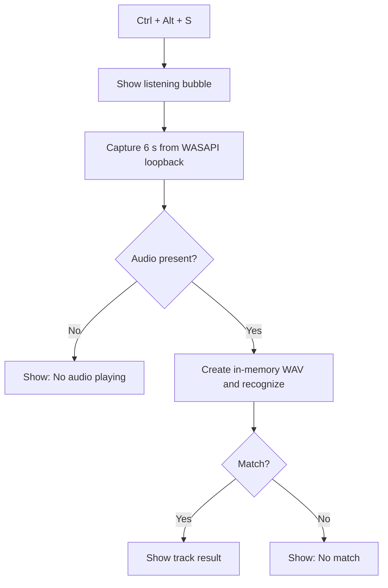
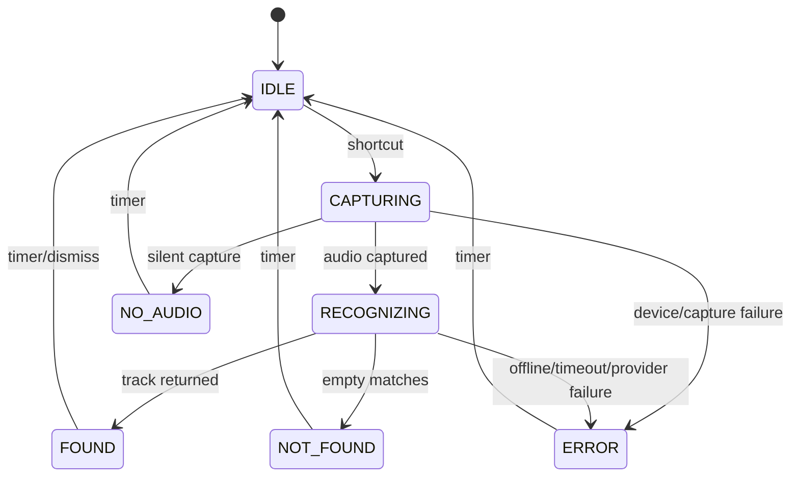
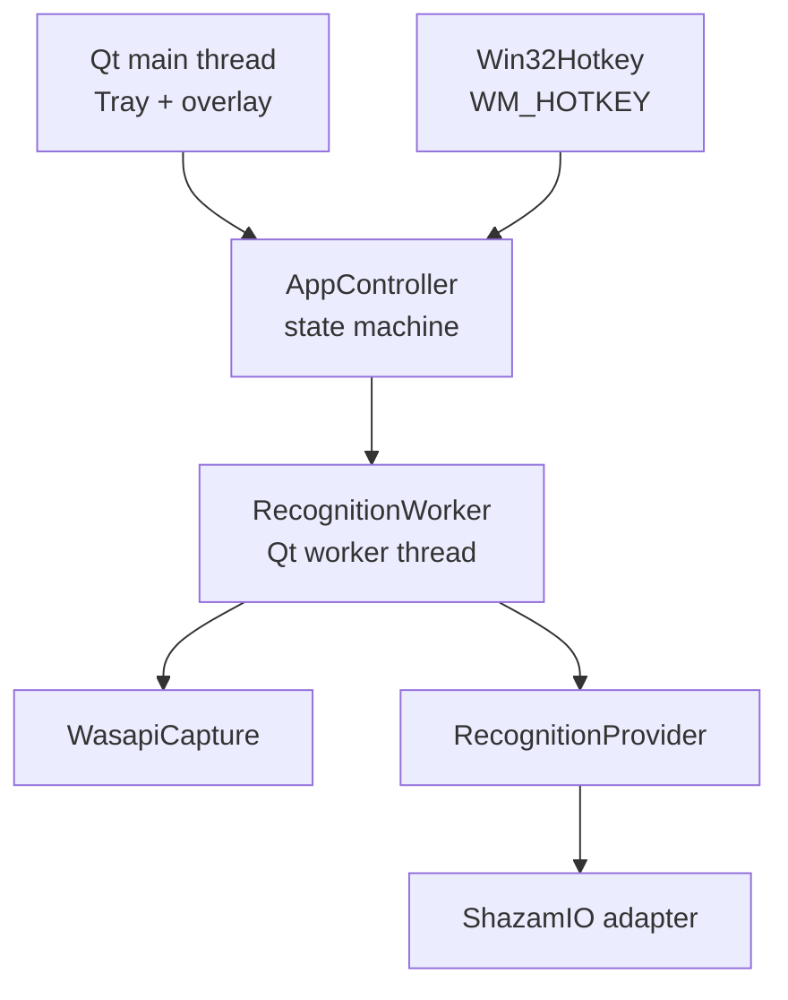

# SongKey: Windows System-Audio Song Recognition

**Technical design and implementation plan**  
Status: Proposed  
Target: Windows 10/11 desktop, x64  
Language: Python 3.12  
Last reviewed: 2 September 2026

## 1. Executive decision

Build **SongKey** as a small, tray-resident Windows application:

> Press `Ctrl + Alt + S` → a glowing bubble appears immediately → SongKey captures six seconds of the audio currently playing through the default Windows output device → ShazamIO identifies the track → the bubble expands into a result card.

The name **SongKey** is intentional: it connects the keyboard shortcut that activates the utility with a musical key. The user-facing product name is `SongKey`; the repository and Python package use lowercase `songkey`. Suggested tagline: **“Press a key. Name the song.”**

The implementation should remain entirely in Python. The recommended runtime stack is:

| Concern | Choice | Why |
| --- | --- | --- |
| Desktop UI | PySide6 Widgets | Mature native desktop toolkit; supports transparent frameless windows, tray icons, animation, and Windows handles in one package. |
| System-audio capture | PyAudioWPatch | Exposes Windows WASAPI loopback devices to Python and ships Windows wheels. |
| Recognition | ShazamIO behind a local adapter | No API key or paid plan; current `recognize()` accepts in-memory bytes and uses its Rust-backed recognizer. |
| Global shortcut | Win32 `RegisterHotKey` through `ctypes` | Built into Windows and Python; avoids another hotkey dependency and does not require administrator privileges. |
| Concurrency | One Qt worker object on one `QThread` | Keeps capture and network work off the GUI thread without adding an asyncio/Qt bridge. |
| Local data | JSON settings; SQLite only when history is added | Both are available through the Python standard library. |
| Packaging | PyInstaller `--onedir` | Free, debuggable, faster to start than `--onefile`, and easy to distribute as a ZIP. |
| Tests | pytest + pytest-qt | Supports dependency injection, Qt signal assertions, and hardware/live test markers. |

The complete v1 has no subscription, hosted server, API key, installer fee, store fee, or mandatory cloud account. The only external runtime requirement is an internet connection to the recognition service.

## 2. Goals and boundaries

### 2.1 v1 goals

1. Start silently and live in the Windows notification area.
2. Register `Ctrl + Alt + S` system-wide without administrator rights.
3. Show visual feedback within 100 ms of receiving the shortcut.
4. Capture the mix currently playing through the **default output endpoint**, not the microphone.
5. Keep the captured PCM/WAV audio in memory and discard it after recognition.
6. Show title, artist, cover art when available, and useful actions.
7. Never freeze or steal focus from the foreground application while listening or recognizing.
8. Handle silence, missing devices, shortcut conflicts, network failure, no-match responses, and provider errors visibly but unobtrusively.
9. Run all automated tests locally at no cost.
10. Package into an unsigned, portable Windows folder/ZIP.

### 2.2 Explicit non-goals for v1

- Offline recognition.
- Microphone recognition.
- Per-application audio isolation.
- Continuous or rolling background recording.
- Spotify login, OAuth, playlist insertion, or any paid music API.
- A permanent full-size application window or recognition history browser.
- Cross-platform support.
- An installer, auto-updater, Microsoft Store release, or paid code signing.
- Reimplementation of the Shazam fingerprint algorithm.

These are scope controls, not architectural dead ends. The recognition, capture, storage, and UI boundaries leave room for later providers, history, or a rolling buffer without putting them in the first release.

## 3. Product behaviour

### 3.1 Primary flow



### 3.2 Visual states

| State | Appearance | Duration/exit |
| --- | --- | --- |
| Idle | No window; tray icon only | Until shortcut |
| Listening | 64 px translucent orb, soft radial glow, 900 ms pulse, small audio-wave glyph | Six seconds |
| Recognizing | Same orb with slower rotating arc; pulse stops | Until response or timeout |
| Found | Card expands to about 360 × 96 px with cover, title, artist, and actions | Auto-dismiss after six seconds; pause timer while hovered |
| No audio | Dim orb with muted-wave glyph and short label | Dismiss after 2.5 seconds |
| No match | Amber-tinted orb/card with “No match” | Dismiss after 2.5 seconds |
| Error | Red-tinted compact card with a specific, human-readable message | Dismiss after four seconds |

The listening bubble is transparent to mouse input and does not accept focus. The result card accepts mouse input only because it contains intentional actions. Clicking an action is allowed to activate the card because the user has chosen to interact with it.

### 3.3 Result actions without API keys

- **Open Shazam**: use the URL returned by the provider when present.
- **Spotify**: open `https://open.spotify.com/search/<URL-encoded artist and title>` rather than calling Spotify's API.
- **YouTube**: open a YouTube search URL for the artist and title.
- **Copy**: place `Artist — Title` on the clipboard.

All four actions are free and need no account integration. They should be generated from normalized domain data, not from raw Shazam response paths inside UI code.

### 3.4 Multi-monitor placement

Place the overlay at the top centre of the monitor containing the mouse cursor, using `QGuiApplication.screenAt(QCursor.pos())`. Offset it approximately 72 logical pixels below the usable work-area top. Qt handles DPI scaling; all geometry is specified in logical pixels.

## 4. State model

Use an explicit state machine. UI widgets should render state; they should not decide workflow.



Valid states:

```python
class AppState(Enum):
    IDLE = auto()
    CAPTURING = auto()
    RECOGNIZING = auto()
    FOUND = auto()
    NOT_FOUND = auto()
    NO_AUDIO = auto()
    ERROR = auto()
```

Rules:

- Only `IDLE` accepts a recognition trigger.
- A shortcut received in any other state is ignored. Do not queue another capture.
- Every terminal display state returns to `IDLE` through one owned dismissal timer.
- The controller owns transitions and emits immutable view models to the UI.
- The UI never imports PyAudioWPatch or ShazamIO.
- Worker completion from a stale operation ID is ignored. This prevents a late network response from overwriting a newer UI state during future cancellation work.

## 5. Runtime architecture



### 5.1 Main-thread responsibilities

- Create `QApplication`, tray icon, overlay, and controller.
- Acquire the single-instance guard.
- Register and receive the global hotkey.
- Own every widget, animation, and display timer.
- Convert worker signals into state transitions.
- Never perform blocking audio reads, file I/O, image downloads, or network recognition.

### 5.2 Worker-thread responsibilities

Use Qt's **worker-object pattern**: create a `QObject`, move it to a long-lived `QThread`, and communicate only through queued Qt signals/slots. Qt documents this as the appropriate approach for executing worker slots in the target thread and safely connecting signals across threads.

For each accepted trigger, the worker:

1. Resolves the current default WASAPI loopback device.
2. Captures six seconds of 16-bit PCM.
3. Emits `capture_complete(metrics)` so the controller changes the animation to Recognizing.
4. Rejects an all-zero/effectively silent capture without making a network request.
5. Encodes a RIFF/WAV byte string in memory.
6. Calls `asyncio.run()` around one async provider operation in the worker thread.
7. Applies an overall recognition timeout with `asyncio.wait_for()`.
8. Emits `found(Track)`, `not_found()`, or `failed(AppError)`.
9. Drops references to PCM and WAV buffers when complete.

There is no need for `qasync`: the Qt event loop stays on the main thread while a short-lived asyncio event loop exists entirely inside the worker operation. This is intentionally less flexible and substantially simpler.

### 5.3 Shutdown

On tray **Quit**:

1. Disable/unregister the global hotkey.
2. Request worker interruption.
3. Audio capture checks an interruption flag between chunks and exits cleanly.
4. Ask the worker thread's event loop to quit and wait up to two seconds.
5. Do not use `QThread.terminate()`; Qt explicitly discourages forced termination.
6. Close the tray icon and application.

An in-progress network request may not be instantly cancellable; the configured timeout bounds shutdown delay. The process may exit after the two-second graceful window because the user explicitly chose Quit, but it must never leave an orphan subprocess—there are no subprocesses in this design.

## 6. Audio capture design

### 6.1 Why WASAPI loopback

Windows WASAPI loopback captures the mix sent to an output endpoint. Microsoft documents that loopback works even when the hardware does not expose a dedicated loopback device, and that the default capture contains the mix of playing audio. This is exactly the “what the laptop is playing” behaviour required here.

PyAudioWPatch presents loopback endpoints as input devices and provides `get_default_wasapi_loopback()`. Its official example opens a loopback stream using the endpoint's channel count and default sample rate.

### 6.2 Device resolution

Resolve the device **on every trigger**, not only at startup. This allows the user to switch from laptop speakers to wired, Bluetooth, USB, or HDMI output while SongKey remains running.

Resolution algorithm:

1. Confirm the WASAPI host API exists.
2. Ask PyAudioWPatch for the default WASAPI loopback endpoint.
3. Validate `maxInputChannels >= 1` and a positive default sample rate.
4. Open the loopback stream at its native rate, 16-bit integer PCM, and reported input channel count.
5. If the endpoint disappears between lookup and open, re-resolve once; then return `DEVICE_UNAVAILABLE`.

Do not silently fall back to the microphone.

### 6.3 Buffering and WAV construction

Recommended defaults:

```text
capture duration     6.0 seconds
sample format        signed PCM 16-bit little-endian
sample rate          endpoint native rate, usually 44.1 or 48 kHz
channels             endpoint loopback input channels
frames per buffer    1024
storage              list[bytes] during capture, joined once
container            RIFF/WAV built with io.BytesIO + wave
```

At 48 kHz stereo, six seconds requires approximately 1.15 MB of raw PCM. A temporary in-memory copy during WAV construction keeps the peak audio working set under roughly 3 MB. No temporary file is needed because ShazamIO's current `recognize()` dispatches `bytes` and `bytearray` to `recognize_bytes()`.

### 6.4 Silence detection

Compute peak and RMS from the PCM in the worker using NumPy, already pulled in by ShazamIO. Treat a buffer as “no audio” only when it is entirely zero or below a very conservative normalized RMS threshold validated on real hardware. The threshold must live in settings/constants and have a unit test.

Do not aggressively gate quiet audio. A false network request is better than incorrectly telling the user that a quiet song is silence.

### 6.5 Capture limitations

- Loopback records the **entire mix** on the selected endpoint. Notifications, calls, game audio, and music can overlap.
- Protected DRM content can be unavailable to loopback capture depending on the trusted audio driver/content path.
- Bluetooth endpoint changes can briefly invalidate a device between lookup and stream open.
- If an application uses a different physical output endpoint from the Windows default, it will not be captured.
- Exclusive-mode audio applications may interfere with shared capture on some drivers.

These cases need clear error messages and manual hardware tests, not hidden fallbacks.

## 7. Recognition boundary

### 7.1 Domain interface

```python
class RecognitionProvider(Protocol):
    async def recognize(self, wav_bytes: bytes) -> Track | None: ...

@dataclass(frozen=True, slots=True)
class Track:
    provider_id: str | None
    title: str
    artist: str
    cover_url: str | None
    provider_url: str | None
```

`ShazamRecognitionProvider` is the only module allowed to import `shazamio`. It translates provider dictionaries into `Track` and maps provider/network exceptions into SongKey's error taxonomy.

### 7.2 ShazamIO call

Use the current Rust-backed API:

```python
result = await asyncio.wait_for(
    Shazam().recognize(wav_bytes),
    timeout=12.0,
)
```

Do not use the deprecated `recognize_song()`. The upstream README recommends `recognize()`, and the current implementation accepts a path, bytes, or bytearray. It computes the signature through `shazamio-core` and sends recognition request data afterward.

### 7.3 Response parsing

The parser must never scatter nested dictionary access across UI code. It should:

1. Treat a missing or empty `matches` array as no match.
2. Require non-empty title and artist strings for a successful `Track`.
3. Read cover art and provider URLs defensively; both are optional.
4. Tolerate extra provider fields.
5. Convert malformed “success” payloads into `PROVIDER_RESPONSE_INVALID`, not a generic crash.
6. Never log the full provider response by default.

Store representative, hand-reduced JSON fixtures in `tests/fixtures/provider/`; remove tracking data and URLs that are irrelevant to parsing.

### 7.4 Provider risk

ShazamIO is MIT-licensed, free software, but it describes itself as a client for a **reverse-engineered Shazam API**. It is not an official supported Shazam SDK. Therefore:

- No API key or per-request payment is currently required.
- Availability, response shape, rate limits, or access can change without notice.
- This design is appropriate for a personal convenience utility, not a service-level guarantee.
- Do not market the application as official, use Shazam trademarks as the product brand, or imply affiliation.
- Keep the provider adapter replaceable and pin tested dependency versions in release builds.
- If this becomes a public/commercial product, review the service terms and legal position before distribution.

## 8. Windows integration

### 8.1 Global shortcut

Wrap `User32.RegisterHotKey` and `UnregisterHotKey` using `ctypes`. Register:

```text
MOD_CONTROL | MOD_ALT | MOD_NOREPEAT + virtual key S
```

`MOD_NOREPEAT` prevents key auto-repeat from producing repeated triggers. Associate registration with the hidden native Qt window handle and handle `WM_HOTKEY` through a small native event filter. Register and unregister on the GUI thread because the window handle belongs to that thread.

On failure, use `GetLastError()` and show a tray notification: **“Ctrl + Alt + S is already in use. SongKey is running, but recognition is disabled.”** Do not install a low-level keyboard hook as a fallback.

### 8.2 Single instance

Use a named per-user Windows mutex through `CreateMutexW`, for example `Local\SongKeyDesktopApp`. If it already exists, exit after showing or signalling the existing instance if practical. This prevents duplicate tray icons and predictable hotkey conflicts without another dependency.

### 8.3 Start with Windows

Defer automatic startup to v1.1. When added, make it opt-in from the tray and create/remove a per-user startup entry only. It must point to a stable installed folder; a ZIP moved after enabling startup will naturally break the path, which the settings UI should detect.

### 8.4 Local paths and logging

```text
%LOCALAPPDATA%\SongKey\config.json
%LOCALAPPDATA%\SongKey\logs\songkey.log
%LOCALAPPDATA%\SongKey\history.db      # v1.1 only
```

Use `logging.handlers.RotatingFileHandler` with 1 MB per file and three backups. Log state transitions, timing, device name/index, sample format, error codes, and stack traces for unexpected errors. Never log PCM, WAV bytes, fingerprints, full recognition responses, clipboard contents, or URLs containing tracking parameters.

## 9. UI implementation details

### 9.1 Window flags

The overlay is a top-level `QWidget` using:

- `Qt.FramelessWindowHint`
- `Qt.WindowStaysOnTopHint`
- `Qt.Tool`
- `Qt.WindowDoesNotAcceptFocus`
- `Qt.WA_TranslucentBackground`
- transparent-for-input behaviour while it is only the listening orb

Qt's documentation specifically requires `WA_TranslucentBackground` and, on Windows, `FramelessWindowHint` for translucent top-level widgets.

### 9.2 Glow without paid assets

Draw the bubble in `paintEvent()` with `QPainter`:

1. A broad radial gradient for outer glow.
2. A semi-transparent inner circle.
3. A thin highlight arc.
4. A simple vector wave/glyph drawn with paths.

Drive a `pulse` property from 0 to 1 and back using `QPropertyAnimation` over 900 ms. Interpolate radius, glow alpha, and highlight width. This avoids Lottie, GIF licensing, web rendering, and external animation files.

### 9.3 Cover art

Fetch cover art after a match using `QNetworkAccessManager` on the GUI thread. Limit redirects and response size, enforce a short timeout, and cache only the decoded pixmap for the life of the card. If it fails, render the same app-owned gradient used by the orb. Recognition success must not depend on cover-art success.

## 10. Error taxonomy and user messages

| Code | User-facing message | Retry behaviour |
| --- | --- | --- |
| `HOTKEY_UNAVAILABLE` | Shortcut is already in use | Retry from tray/restart after resolving conflict |
| `WASAPI_UNAVAILABLE` | Windows audio capture is unavailable | No automatic fallback |
| `DEVICE_UNAVAILABLE` | No active output device found | Re-resolve once during the same operation |
| `CAPTURE_FAILED` | Couldn't capture system audio | User-triggered retry |
| `NO_AUDIO` | No audio is playing | No network call; user-triggered retry |
| `OFFLINE` | You're offline | User-triggered retry |
| `RECOGNITION_TIMEOUT` | Recognition timed out | User-triggered retry |
| `NO_MATCH` | No match found | User-triggered retry |
| `PROVIDER_RESPONSE_INVALID` | Recognition service returned an unexpected response | Log technical detail; user-triggered retry |
| `INTERNAL_ERROR` | Something went wrong | Log stack trace; remain alive in tray |

Do not automatically retry recognition in v1. Automatic retries increase latency and can accidentally amplify provider traffic. A second shortcut is an explicit retry.

## 11. Repository structure

```text
songkey/
├── .github/
│   └── workflows/
│       └── windows.yml                 # Optional public-repo CI; local tests remain canonical
├── assets/
│   ├── icons/
│   │   ├── songkey.ico                 # App-owned Windows icon
│   │   └── songkey.svg                 # Editable vector source
│   └── licenses/                       # Third-party notices copied for distribution
├── docs/
│   ├── design.md                       # This document
│   ├── manual-test-plan.md             # Human hardware/UX test script
│   └── release-checklist.md
├── packaging/
│   └── songkey.spec                    # Reproducible PyInstaller onedir build
├── scripts/
│   ├── diagnose_audio.py               # Lists WASAPI/loopback devices and captures test metrics
│   └── smoke_recognize.py              # User-supplied audio file → parsed Track
├── src/
│   └── songkey/
│       ├── __init__.py
│       ├── __main__.py                 # `python -m songkey`
│       ├── bootstrap.py                # Composition root; the only place wiring concrete adapters
│       ├── app/
│       │   ├── controller.py           # State transitions and operation IDs
│       │   ├── errors.py               # AppErrorCode + safe user messages
│       │   ├── paths.py                # LOCALAPPDATA paths
│       │   ├── settings.py             # Validated JSON settings
│       │   └── state.py                # AppState and immutable UI view models
│       ├── audio/
│       │   ├── models.py               # AudioFormat, CaptureMetrics, CapturedAudio
│       │   ├── protocols.py            # AudioCapture Protocol
│       │   ├── silence.py              # Conservative NumPy metrics
│       │   ├── wasapi.py               # PyAudioWPatch adapter only
│       │   └── wav.py                  # Pure in-memory RIFF/WAV encoder
│       ├── recognition/
│       │   ├── models.py               # Track domain model
│       │   ├── parser.py               # Provider dict → Track | None
│       │   ├── protocols.py            # RecognitionProvider Protocol
│       │   └── shazam.py               # The only ShazamIO import
│       ├── runtime/
│       │   └── worker.py               # QObject moved to QThread; capture + async recognition
│       ├── platform/
│       │   └── windows/
│       │       ├── hotkey.py            # RegisterHotKey + native event filter
│       │       └── single_instance.py   # Per-user named mutex
│       └── ui/
│           ├── bubble.py                # Listening/recognizing custom paint + animation
│           ├── overlay.py               # State-driven window shell and placement
│           ├── result_card.py           # Found/no-match/error views and actions
│           └── tray.py                  # Recognize, diagnostics/about, quit
├── tests/
│   ├── conftest.py
│   ├── fixtures/
│   │   └── provider/
│   │       ├── match.json
│   │       ├── no_match.json
│   │       └── malformed.json
│   ├── unit/
│   │   ├── test_controller.py
│   │   ├── test_parser.py
│   │   ├── test_settings.py
│   │   ├── test_silence.py
│   │   ├── test_state.py
│   │   ├── test_urls.py
│   │   └── test_wav.py
│   ├── integration/
│   │   ├── test_controller_pipeline.py # Fake capture + fake provider + real signals
│   │   ├── test_overlay.py             # pytest-qt rendering/state behaviour
│   │   └── test_worker.py
│   ├── hardware/
│   │   ├── test_hotkey_windows.py      # Marked hardware; opt-in
│   │   └── test_wasapi_capture.py      # Marked hardware; opt-in
│   └── live/
│       └── test_shazam_provider.py      # User-supplied clip; marked live; opt-in
├── .gitignore
├── .python-version                     # 3.12
├── LICENSE                             # Project license, e.g. MIT
├── README.md
├── THIRD_PARTY_NOTICES.md
├── pyproject.toml
└── requirements-lock.txt               # Exact release dependency set
```

### 11.1 Dependency direction

```text
ui ───────────────┐
platform/windows ─┼──> app/controller + app models
runtime/worker ───┘             │
                                ▼
                 audio protocols + recognition protocols
                                ▲
                    concrete adapters are wired only in bootstrap.py
```

Rules enforced in review:

- Domain/state modules do not import PySide6, PyAudioWPatch, or ShazamIO.
- UI does not import concrete capture/recognition adapters.
- The worker depends on protocols, not provider dictionaries.
- `bootstrap.py` is the composition root and may import everything required to wire the app.
- Windows-only code stays under `platform/windows` or the WASAPI adapter.
- Tests replace protocols with fakes; they do not patch deep third-party internals unless testing an adapter.

This is enough separation to make hardware and network behaviour testable without becoming a framework.

## 12. Dependency and build policy

### 12.1 Runtime dependency ranges

```toml
[project]
requires-python = ">=3.12,<3.13"
dependencies = [
  "PySide6>=6.8,<7",
  "PyAudioWPatch>=0.2.12.8,<0.3",
  "shazamio>=0.8.1,<0.9",
]

[project.optional-dependencies]
dev = [
  "pytest>=8,<9",
  "pytest-qt>=4.4,<5",
  "pytest-cov>=6,<8",
  "ruff>=0.12,<1",
  "mypy>=1.15,<2",
  "pyinstaller>=6,<7",
]
```

Use ranges during development and commit an exact `requirements-lock.txt` for releases. Dependency upgrades are separate pull requests and must run the full non-live suite plus Windows packaging smoke tests.

### 12.2 Why Python 3.12

- Supported by ShazamIO, PySide6, and a published PyAudioWPatch Windows wheel.
- Mature PyInstaller support.
- Avoids choosing the newest interpreter while native-extension and packaging compatibility settles.
- A narrow version target makes the Windows audio matrix and packaged artifact reproducible.

### 12.3 PyInstaller build

Build on Windows; PyInstaller is not a cross-compiler.

```powershell
py -3.12 -m venv .venv
.\.venv\Scripts\Activate.ps1
python -m pip install --upgrade pip
python -m pip install -e ".[dev]"
python -m pytest -m "not hardware and not live"
pyinstaller .\packaging\songkey.spec --clean --noconfirm
```

The spec should produce a windowed `dist/SongKey/SongKey.exe`, bundle the Qt platform plugin and the `shazamio-core` native extension, include app assets and notices, and disable UPX. Verify hidden imports through the packaging smoke test rather than adding broad `collect_all()` calls without evidence.

Prefer `onedir` because it:

- starts without unpacking itself to a temporary directory;
- makes missing DLL/plugin failures inspectable;
- is easier for a personal project to update by replacing a folder;
- is officially supported by PyInstaller as the default bundle shape.

## 13. Test strategy

### 13.1 Test markers

| Marker | Default run? | Network? | Windows hardware? | Purpose |
| --- | --- | --- | --- | --- |
| unit (unmarked) | Yes | No | No | Pure logic, WAV, parsing, settings, transitions |
| `integration` | Yes | No | No | Real Qt signals/controller with fake boundaries |
| `hardware` | No | No | Yes | WASAPI and native hotkey behaviour |
| `live` | No | Yes | Usually Windows | Actual ShazamIO compatibility with a user-provided clip |
| `packaging` | Release only | No/live optional | Yes | Frozen executable starts and contains required binaries |

The default suite must be deterministic, run offline, and cost nothing:

```powershell
python -m pytest -m "not hardware and not live and not packaging" --cov=songkey
```

### 13.2 Unit test inventory

**State/controller**

- `IDLE + trigger → CAPTURING`.
- A second trigger in `CAPTURING` or `RECOGNIZING` starts no additional worker operation.
- Capture-complete changes only the active operation to `RECOGNIZING`.
- Late signals with a stale operation ID are ignored.
- Every terminal view returns to `IDLE` after the correct timer.
- An unexpected worker error is mapped to a safe `INTERNAL_ERROR` message and the tray process survives.

**Audio/WAV**

- RIFF/WAVE headers contain correct channel count, sample width, rate, and data length.
- Six seconds at 48 kHz stereo produces the expected frame count.
- Empty data and inconsistent formats are rejected.
- Silence metrics correctly classify zeros, near-silence, and a generated sine wave.
- No WAV encoder path opens a filesystem file.

**Provider parser**

- Match fixture returns the expected frozen `Track`.
- Empty/missing matches return `None`.
- Missing artwork/URL still returns a valid track.
- Missing title or artist produces `PROVIDER_RESPONSE_INVALID`.
- Extra provider fields do not change parsing.
- Action URLs are URL-encoded and contain no provider tracking fields.

**Settings/platform wrappers**

- Missing config returns defaults.
- Malformed config is backed up/ignored and defaults safely.
- Unsupported hotkey values fail validation.
- Win32 wrapper calls unregister exactly once after successful registration.
- Registration failure preserves the OS error code.

### 13.3 Representative controller test

```python
def test_second_trigger_is_ignored_while_capturing(qtbot):
    capture = DeferredFakeCapture()
    provider = FakeProvider(track=Track("1", "Song", "Artist", None, None))
    controller = make_controller(capture=capture, provider=provider)

    controller.trigger()
    controller.trigger()

    assert controller.state is AppState.CAPTURING
    assert capture.call_count == 1
```

This test is possible because the controller receives protocols/fakes, not because tests mock PyAudioWPatch from inside UI code.

### 13.4 Qt integration tests

Use `pytest-qt` and `qtbot.waitSignal()` to verify asynchronous signal behaviour with timeouts:

- Trigger → `CAPTURING` view signal → `RECOGNIZING` → `FOUND`, in order.
- The orb is visible in capturing/recognizing states and hidden in `IDLE`.
- Listening animation property changes over time.
- Result card contains exact title/artist and fallback art when the image fails.
- Dismiss timer pauses while hovered and resumes after leave.
- Bubble window carries non-focus and transparent-background flags.
- No error signal is emitted during the fake success pipeline.

Avoid pixel-perfect screenshots as the primary assertion because rendering can vary by Windows/DPI. Assert geometry ranges, flags, visible text, state, and signals; keep one manual visual pass for release.

### 13.5 Hardware tests

Hardware tests are opt-in and run only on a Windows workstation:

```powershell
python -m pytest -m hardware -s
```

They should:

1. Enumerate WASAPI and loopback devices.
2. Confirm the selected loopback corresponds to the current default output.
3. Capture two seconds while the tester plays audio.
4. Assert non-zero frames, plausible RMS, correct duration within tolerance, and a decodable WAV header.
5. Register a test hotkey, wait for the tester to press it, receive exactly one event with `MOD_NOREPEAT`, and unregister it.

No test may choose a microphone as fallback or record indefinitely.

### 13.6 Live recognition test

Do not commit copyrighted song clips. The live test reads a file selected by the developer:

```powershell
$env:SONGKEY_TEST_AUDIO = "C:\path\to\your\short-test-clip.wav"
$env:SONGKEY_EXPECTED_ARTIST = "Expected Artist"   # optional
python -m pytest -m live -s
```

The test verifies:

- the current ShazamIO version accepts WAV bytes;
- the call completes before the timeout;
- the adapter returns `Track | None` without leaking raw provider dictionaries;
- if an expected artist/title is supplied, normalized values match.

The test is never part of the default suite because it uses the network, depends on third-party service state, and can be flaky for a specific audio excerpt.

### 13.7 Packaging smoke test

On a clean Windows user profile or Windows Sandbox:

1. Build `dist/SongKey`.
2. Launch `SongKey.exe` with no Python installation available.
3. Verify one tray icon and one process.
4. Launch it again; verify the second process exits and no duplicate tray icon appears.
5. Press the shortcut and confirm the bubble appears.
6. Complete one real recognition through speakers.
7. Disconnect the network and verify the offline message.
8. Quit through the tray; verify no process remains.
9. Inspect logs for absence of PCM, WAV, fingerprints, and raw responses.

### 13.8 Manual acceptance matrix

| Scenario | Expected result |
| --- | --- |
| Chrome/Spotify/VLC playing through laptop speakers | Correct endpoint captured; a mainstream song is identified |
| Wired headphones selected after SongKey starts | Next trigger resolves headphones without restart |
| Bluetooth headphones selected after SongKey starts | Next trigger either succeeds or gives a clear endpoint error; no crash |
| HDMI monitor selected | HDMI loopback is resolved and captured |
| No audio playing | “No audio playing”; no recognition request |
| Speech/podcast only | No match is acceptable; process stays healthy |
| Network disconnected during capture | Capture finishes, then offline message |
| Shortcut pressed five times rapidly | One capture operation and one bubble only |
| Shortcut conflicts with another app | Tray explains conflict; SongKey remains quit-able |
| Full-screen video/game | Bubble stays on top and does not steal keyboard focus |
| 125%, 150%, and mixed-DPI monitors | Bubble remains crisp, correctly sized, and on the cursor's monitor |
| Explorer restarted | App remains running; tray icon recovers if Qt supports the shell restart path |
| Sleep/resume and output-device change | First subsequent trigger re-resolves device and does not crash |

### 13.9 Quality gates

Release v1 only when:

- All offline unit/integration tests pass.
- Critical pure modules (`app`, `audio/wav`, `recognition/parser`) have at least 90% branch coverage; total project coverage target is 80%, excluding platform adapter lines that require hardware.
- Ruff and mypy pass.
- Hardware matrix passes on at least Windows 11 with speakers and one headphone endpoint.
- A packaged build completes three consecutive real recognition attempts without UI freeze.
- Shortcut-to-visible-bubble is under 100 ms in normal conditions.
- Idle CPU is under 1% and no audio stream remains open in `IDLE`.
- No raw audio is created on disk.
- Packaged app starts on a clean profile without Python installed.

## 14. Free-cost and licensing analysis

| Item | Cost | Licence/status | Decision |
| --- | ---: | --- | --- |
| Python 3.12 | $0 | PSF License | Use |
| PySide6 | $0 | LGPLv3/GPL/commercial options | Use open-source LGPL route; retain notices and dynamic libraries |
| PyAudioWPatch | $0 | Apache-2.0 | Use and retain notice |
| ShazamIO | $0 | MIT; unofficial reverse-engineered API client | Use only behind adapter; accept availability risk |
| SQLite/JSON/logging/ctypes | $0 | Python standard library; SQLite public domain | Use |
| PyInstaller | $0 | GPL with an exception allowing bundled applications | Use `onedir` |
| pytest / pytest-qt / Ruff / mypy | $0 | Open-source developer tools | Use locally |
| App icon/animation | $0 | Created for this project | Do not use Shazam logos/assets |
| Distribution | $0 | ZIP from GitHub Releases or direct sharing | No installer/store required |
| Code signing | **Not included** | Trusted certificates commonly cost money | Keep personal build unsigned |

For personal use, the stack is free. If binaries are distributed, include `THIRD_PARTY_NOTICES.md` and the licence texts required by bundled dependencies, keep Qt libraries dynamically replaceable within the onedir bundle, do not prohibit reverse engineering for LGPL debugging, and review the final dependency tree. This is an engineering compliance plan, not legal advice.

### What “free” does and does not mean

- There is no direct software or API charge in the proposed build.
- Existing Windows hardware, internet access, and electricity are assumed.
- The recognition backend can change its access policy later; “free today” is not a service guarantee.
- An unsigned executable can trigger Windows SmartScreen reputation warnings. Eliminating those warnings for broad public distribution may require a paid certificate and reputation-building, but neither is required for your personal build.
- A public GitHub repository can use public-repository CI at no direct charge, but local tests remain the source of truth so the project does not depend on CI minutes.

## 15. Delivery plan

### Milestone 0 — feasibility spikes

Deliver three disposable scripts before building UI:

1. `diagnose_audio.py`: resolve current default WASAPI loopback, capture six seconds, print format/RMS/duration, optionally save only when an explicit diagnostic flag is given.
2. `smoke_recognize.py`: pass a user-supplied WAV as bytes to the pinned ShazamIO version and print the normalized `Track`.
3. Minimal PyInstaller spike: freeze a script importing PySide6, PyAudioWPatch, and ShazamIO to prove native extensions/plugins are included.

**Exit criterion:** all three pass on the target Windows laptop. This de-risks the only hardware, provider, and packaging uncertainties before UI work.

### Milestone 1 — headless core

- Domain models, errors, protocols, WASAPI adapter, in-memory WAV encoder, silence metrics, Shazam adapter/parser.
- Fake-driven tests plus opt-in hardware/live tests.
- Simple CLI path: capture → recognize → normalized result.

**Exit criterion:** repeated headless recognition works without files on disk.

### Milestone 2 — resident app

- QApplication, tray menu, single-instance mutex, native global hotkey, controller/state machine, worker thread.
- Clear errors and rotating logs.

**Exit criterion:** app remains responsive through success, no audio, offline, and rapid-trigger tests.

### Milestone 3 — polished overlay

- Custom glow animation, current-monitor placement, non-focus behaviour, recognizing arc, result/error card, cover art fallback, actions.
- pytest-qt tests and manual DPI/full-screen pass.

**Exit criterion:** the utility feels instantaneous and never interrupts the foreground app unless the user clicks a result action.

### Milestone 4 — release artifact

- PyInstaller spec, app-owned icon, third-party notices, clean-profile smoke test, release checklist, ZIP.

**Exit criterion:** a clean Windows account can unzip, launch, recognize, and quit without Python installed.

Likely effort for one developer familiar with Python: one focused day for spikes/core, one to two days for Windows integration, one to two days for UI polish/tests, and half a day for packaging/clean-machine verification. Hardware-specific failures can extend that estimate; the milestone gates are more reliable than the calendar estimate.

## 16. Deferred v1.1/v0.2 work

Prioritized only after v1 is stable:

1. **Local history** in SQLite with deduplication and delete/clear controls.
2. **Configurable shortcut** through a small settings dialog.
3. **Opt-in start with Windows**.
4. **Rolling buffer experiment**: retain about four seconds in RAM and capture two seconds after the shortcut, with a visible privacy toggle and idle CPU measurement.
5. **Provider health diagnostics** and a second recognition adapter if a legitimate free alternative exists.
6. **Per-process capture** on supported Windows versions, only if whole-system mix becomes a real problem.

Do not start with the rolling buffer. It opens an audio stream continuously, complicates device switching and shutdown, consumes idle resources, and changes the privacy story for a modest perceived-speed improvement.

## 17. Open risks and mitigations

| Risk | Likelihood | Impact | Mitigation |
| --- | --- | --- | --- |
| Shazam endpoint or response changes | Medium | High | Provider protocol, parser fixtures, pinned release, opt-in live test |
| PyInstaller misses native extension/plugin | Medium during first build | High | Milestone-0 frozen import spike and clean-profile packaging test |
| Default output changes or disappears | High over normal use | Medium | Resolve each trigger and retry lookup once |
| Hotkey already claimed | Medium | Medium | Native registration result checked; clear tray message; configurable key later |
| Overlay steals focus in games/full-screen apps | Medium | High UX impact | Non-focus/tool flags, transparent input during sensing, manual full-screen matrix |
| False silence detection | Low/Medium | Medium | Conservative threshold, generated-wave unit tests, real quiet-volume testing |
| Protected/exclusive audio cannot be captured | Low/Medium | Medium | Document limitation and return specific capture/no-audio message |
| Unsigned executable warning | High when shared | Medium | Accept for personal v1; publish source/build instructions; signing is optional paid scope |
| Third-party licence omissions | Low | Medium | Lock dependencies, generate notices, retain required texts, review distribution bundle |

## 18. References

Primary and upstream references used for these decisions:

1. [ShazamIO repository and recognition example](https://github.com/shazamio/ShazamIO) — upstream README, current Rust-backed `recognize()` recommendation, MIT licence.
2. [ShazamIO `recognize()` implementation](https://github.com/shazamio/ShazamIO/blob/master/shazamio/api.py) — current `str`/`bytes`/`bytearray` dispatch and local signature-to-request flow.
3. [ShazamIO on PyPI](https://pypi.org/project/shazamio/) — published Python requirement, release metadata, and licence.
4. [PyAudioWPatch repository](https://github.com/s0d3s/PyAudioWPatch) — WASAPI loopback support, Windows wheels, helper methods, and upstream examples.
5. [PyAudioWPatch default-loopback recording example](https://github.com/s0d3s/PyAudioWPatch/blob/master/examples/pawp_record_wasapi_loopback.py) — device selection, native format, and stream-open pattern.
6. [Microsoft: WASAPI loopback recording](https://learn.microsoft.com/en-us/windows/win32/coreaudio/loopback-recording) — operating-system behaviour, mix capture, and protected-content limitation.
7. [Microsoft: `RegisterHotKey`](https://learn.microsoft.com/en-us/windows/win32/api/winuser/nf-winuser-registerhotkey) — system-wide registration, `WM_HOTKEY`, `MOD_NOREPEAT`, conflicts, and cleanup contract.
8. [Qt for Python: `QWidget` transparency](https://doc.qt.io/qtforpython-6/PySide6/QtWidgets/QWidget.html) — translucent top-level widgets and the Windows frameless-window requirement.
9. [Qt for Python: `QThread`](https://doc.qt.io/qtforpython-6/PySide6/QtCore/QThread.html) — worker-object pattern, queued cross-thread signals, interruption, and shutdown guidance.
10. [PySide6 on PyPI](https://pypi.org/project/PySide6/) — supported Python range and LGPL/GPL/commercial licensing options.
11. [PyInstaller operating modes](https://pyinstaller.org/en/stable/operating-mode.html) — one-folder and one-file bundle behaviour.
12. [PyInstaller licence](https://pyinstaller.org/en/stable/license.html) — GPL exception for distributing bundled applications.
13. [pytest monkeypatch guidance](https://docs.pytest.org/en/stable/how-to/monkeypatch.html) — replacing network/global boundaries in deterministic tests.
14. [pytest-qt `waitSignal`](https://pytest-qt.readthedocs.io/en/latest/signals.html) — bounded assertions for worker and Qt signal flows.

## 19. Final recommendation

Proceed with the Python design exactly through Milestone 0 before investing in the visual polish. The core bet is sound: Windows already supplies system-output capture, ShazamIO accepts in-memory bytes, and PySide6 can deliver the desired transparent overlay. The most consequential design decisions are the ones that keep the app boring internally:

- one explicit controller state machine;
- one worker thread;
- one capture adapter;
- one replaceable recognition provider;
- no disk audio;
- no continuous listening;
- no installer, account, server, or paid API.

That produces the shortest path to a utility you can actually leave running on your own laptop while preserving enough structure to test it properly and replace the unofficial provider if necessary.
